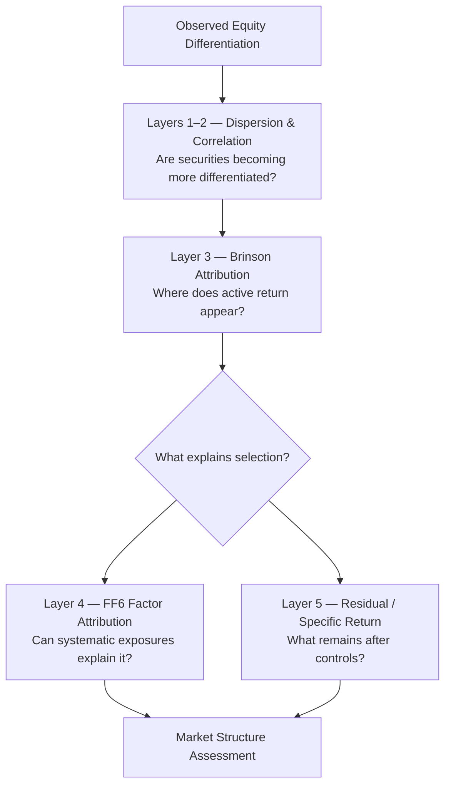

# Project Parallax

**Equity Dispersion, Attribution, and the Changing Importance of Security Selection**

---

> **Status: Phase 1 Complete | Phase 2 Pending Gates | No Hypothesis Testing Has Occurred**

---

## Current State

Phase 0 literature reconnaissance is complete. The literature establishes that the secular rise in idiosyncratic volatility documented by Campbell, Lettau, Malkiel & Xu (2001) over 1962–1997 did not persist cleanly after approximately 2001 (CLMX 2022; Chiah, Gharghori & Zhong 2020). H1 therefore remains a genuinely open question — it is not an assumed finding.

Phase 1 data feasibility is complete. The CLMX three-component variance decomposition (MKT/IND/FIRM) has been implemented, validated on 24 synthetic known-answer cases (24/24 PASS), and executed on live historical data across all 180 months of the 2010–2024 primary study window (D-020 resolved). The two open methodological decisions have been resolved:

- **D-018 RESOLVED — Option B (complete\_month):** A stock-month is eligible only when the stock has return observations on every cached trading day for that month. This is the canonical treatment for Phase 1. The q_t audit confirmed that Option A and Option B produce numerically identical component totals (delta < 1e-15) across all 180 months for this dataset, validating the selection without a numerical tradeoff.
- **D-020 RESOLVED — 2010–2024 (180 months):** The extended window 2005–2009 was evaluated and failed the ≥85% coverage gate. The primary 2010–2024 window is canonical.

**Phase 1 replication statistics (WP-05, Option B, 2010–2024 — replication validation, not H1 evidence):**

The CLMX decomposition produces two distinct FIRM variance share statistics that must not be conflated:

- **39.95%** — FIRM as a share of total variance, computed as a ratio of the summed monthly components across all 180 months (ratio of total-period sums).
- **46.32%** — FIRM as a share of total variance, computed as the arithmetic mean of the monthly FIRM/(MKT+IND+FIRM) ratios across all 180 months (mean of monthly ratios). Higher than the ratio-of-sums because months with low total variance carry disproportionately high FIRM share.

**Survivorship limitation:** The ticker universe is derived from current S&P 500 constituent membership projected backward. Securities that entered and exited the index during 2010–2024 without surviving to the current list are excluded. The direction and magnitude of the resulting survivorship bias on FIRM variance share have not been empirically established for this dataset. No directional claim is made.

These statistics are presented as replication validation output. Phase 2 hypothesis testing has not been authorized and has not begun. The research question remains open in both directions.

---

## Why Parallax?

Parallax is the apparent shift of an object when viewed from different positions. The shift is not noise — it is information about the object's structure.

This project applies that idea analytically. The same equity-market outcome looks different depending on the lens:

- **Dispersion** measures how far apart security returns move.
- **Correlation** measures how consistently they move together.
- **Brinson attribution** describes active portfolio return through allocation and selection.
- **Factor attribution** asks whether apparent selection reflects systematic exposures.
- **Residual analysis** measures what remains after systematic exposures are removed.

The differences among those perspectives may reveal something about the structure of returns that any single viewpoint would obscure.

---

> *The project begins with an intuition, but the intuition does not get a vote once the evidence arrives.*

---

## Research Question

Has the share of individual-security return variation not explained by common systematic exposures increased over time within at least some areas of the U.S. equity market?

Put directly: **does the individual company matter more today than it once did?**

---

## Why This Is Harder Than It Looks

Three related concepts are frequently conflated. The project's central methodological commitment is to keep them distinct.

**Dispersion** — Securities can spread apart without those differences being firm-specific. A common factor shock can produce wide dispersion if companies carry different exposures.

**Brinson selection effect** — A portfolio can generate selection attribution because its securities outperformed sector peers. That does not establish the return was idiosyncratic. The selected securities may simply carry systematically different factor exposures than their benchmark peers.

**Specific / residual return** — After controlling for common systematic exposures, remaining unexplained return variation is specific or residual. This is closest to the underlying hypothesis: that the individual company is contributing more independently to its own behavior.

These three may move together. They are not assumed to. Determining whether they tell a consistent story — or different ones — is part of the research.

---

## Hypotheses

**H1 — Rising Security-Specific Importance**
Within at least some U.S. sectors or industries, the portion of security return variation remaining after systematic controls has increased over time.

Supporting sub-hypotheses and the primary operationalization are documented in the [Project Charter](PROJECT_CHARTER.md).

**H0 — No Meaningful Structural Increase**
After controlling for data quality, systematic factors, market volatility, changing constituent membership, and relevant regimes, there is no persistent increase in security-specific importance.

**A result supporting H0 is a successful outcome of this project.**

---

## Four Competing Explanations

| | Explanation | Core Claim |
|---|---|---|
| A | Genuine Idiosyncratic Divergence | Firms increasingly behave differently for firm-specific reasons |
| B | Classification Failure | Sector / industry labels increasingly group companies with systematically different exposures |
| C | Regime Effects | The apparent trend is cyclical or conditional, not secular |
| D | Availability Bias | Visible large-stock moves make the phenomenon appear stronger than it is |

The project must distinguish among these. Reporting which one fits the data is not sufficient.

---

## Analytical Framework

Each layer answers a different question and requires different methods.

| Layer | Question |
|---|---|
| 1 — Dispersion | Are security outcomes becoming more differentiated? |
| 2 — Correlation | Are securities classified together behaving less similarly? |
| 3 — Brinson Attribution | Where does active return appear: allocation or selection? |
| 4 — Factor Attribution | Can systematic exposures explain apparent selection? |
| 5 — Specific Return | What remains after systematic controls? |
| 6 — Macro Regimes | When does the structure change? *(later extension)* |

Factor baseline: **Fama-French Five Factors + Momentum (FF6)**
Source: [Kenneth French Data Library](https://mba.tuck.dartmouth.edu/pages/faculty/ken.french/data_library.html)

---

## Data Strategy

**Initial universe:** S&P 500 *(provisional — see Open Decisions below)*
**Market data:** Yahoo Finance / yfinance
**Factor data:** Kenneth French Data Library

Current-constituent S&P 500 membership is not treated as historical point-in-time membership. Survivorship bias is a first-class design risk.

The data pipeline explicitly monitors missing historical securities, delistings, constituent changes, incomplete return histories, and sector reclassifications. Bias diagnostics are implemented alongside ingestion, not added as cleanup after results exist.

If the free dataset materially distorts inference, the project will document the failure and migrate to an improved source.

> Discovering that a dataset cannot answer a question reliably is itself a research result.

---

## Research Roadmap

| Phase | Question | Output | Status |
|---|---|---|---|
| 0 | What is already known? | Literature review | ✅ Complete |
| 1 | Can the data answer the question? | Bias & feasibility report | ✅ Complete (WP-05: D-018/D-020 resolved, implementation hardened) |
| 2 | Does the phenomenon exist? | Dispersion / correlation analysis | ⏳ Pending gates |
| 3 | Does the attribution engine behave correctly? | Brinson engine + known-answer tests | ⏳ Pending gates |
| 4 | What do systematic factors explain? | Factor attribution engine | ⏳ Pending gates |
| 5 | Where do the frameworks agree and disagree? | Comparative attribution | ⏳ Pending gates |
| 6 | Has the structure changed through time? | Structural analysis | ⏳ Pending gates |
| 7 | When does the macro environment matter? | Regime analysis | ⏳ Future extension |

No phase is treated as mandatory if an earlier gate invalidates the underlying question.

---

## Open Design Decisions

These decisions are intentionally unresolved. They will be registered before substantive hypothesis testing begins.

- **Return frequency** — Daily, weekly, or monthly? Selection will be based on methodological requirements, literature precedent, and statistical properties of the measures used — not convenience.
- **Historical horizon** — The start date will be determined by data quality, regime coverage, and survivorship-bias severity — not by which horizon produces more favorable results.
- **Universe** — S&P 500 is provisional. Adequacy depends on Phase 1 survivorship and constituent-coverage validation.

Publishing unresolved decisions before results exist is the point.

---

## AI-Assisted Development

AI tools are used for code development, literature discovery, methodological critique, debugging, and documentation. AI output is not treated as empirical evidence. Research conclusions must trace to reproducible calculations, verified data, transparent methodology, and appropriate external research.

AI can accelerate the construction of research tools. It does not get to decide whether the hypothesis is true.

---

## Related Research

**[vd-cloud](https://github.com/MJNolan37/vd-cloud)** — Earlier research examining whether volatility and dispersion measures can identify useful market regimes. Project Parallax approaches dispersion from a different direction: asking how changing security differentiation relates to portfolio attribution and the systematic versus specific decomposition of returns.

---

[Project Charter](PROJECT_CHARTER.md) · [Research Log](RESEARCH_LOG.md) · [Bibliography](docs/bibliography.md) · [Methodology](docs/methodology.md) · [Live Data Execution](docs/live_data_execution_handoff.md)
